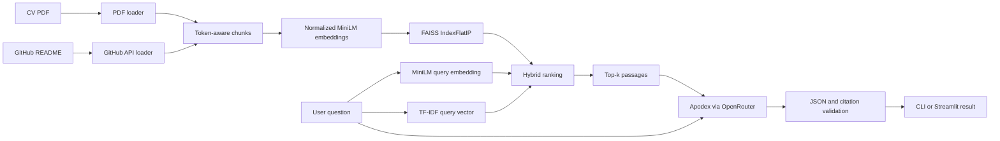

e# Cellula Technologies - Week 3, Task 3

This repository contains two deliverables:

1. A research report about **BigBird and sparse attention for long sequences**.
2. A deployed **retrieval-augmented generation (RAG) knowledge base** that answers questions about Nafe Abubaker's professional background using a CV and a GitHub project README.

> **Live application:** [Open Nafe's Professional Knowledge Base](https://cellula-tech-task-3.streamlit.app/)
>
> The app is hosted on Streamlit Community Cloud. Streamlit may request sign-in depending on the deployment's visibility settings.

## Repository overview

| Folder | Deliverable | Description |
| --- | --- | --- |
| `Task3_Task0/` | BigBird research | A five-page literature review covering BigBird's motivation, sparse-attention architecture, computational cost, applications, advantages, limitations, and comparison with BERT and Longformer. |
| `Task3_Task1/` | Personal RAG knowledge base | A command-line and Streamlit application that retrieves evidence from a CV and a GitHub README, generates a grounded answer through OpenRouter, and displays citations and source passages. |

```text
Task-3/
|-- README.md
|-- Task3_Task0/
|   +-- Task3_Task0_BigBird_Research.pdf
+-- Task3_Task1/
    |-- README.md
    |-- app.py
    |-- ask_question.py
    |-- load_documents.py
    |-- load_github_readme.py
    |-- chunk_documents.py
    |-- create_embeddings.py
    |-- build_vector_store.py
    |-- retrieve_documents.py
    |-- generate_answer.py
    |-- requirements.txt
    |-- data/
    |   |-- Nafe_Abubaker_CV.pdf
    |   +-- Abubaker-Nafe_ibt-ggateway-capstone_README.md
    +-- output/
        |-- vector_store/
        |   |-- index.faiss
        |   +-- metadata.json
        |-- loaded_documents.json
        |-- chunks.json
        |-- embeddings.npy
        |-- embeddings_metadata.json
        |-- retrieval_results.json
        |-- answer.json
        |-- last_model_response.txt
        |-- last_model_metadata.json
        +-- last_api_error.json
```

For implementation-level documentation, see [`Task3_Task1/README.md`](Task3_Task1/README.md).

## Task 0 - BigBird research

[`Task3_Task0_BigBird_Research.pdf`](Task3_Task0/Task3_Task0_BigBird_Research.pdf) is a literature review rather than a training or runtime-benchmarking experiment. It covers:

- Why the quadratic cost of full self-attention makes long sequences expensive.
- BigBird's combination of local, global, and random attention connections.
- How block-sparse attention makes longer contexts practical.
- Architectural and computational differences between BERT, Longformer, and BigBird.
- Applications in long-document question answering, classification, summarization, and genomics.
- Published BigBird-Pegasus summarization results.
- Practical limitations, including finite context windows, sparse-attention overhead, padding, kernels, and hardware dependence.

The report distinguishes cited experimental results from explanatory examples and calculated attention-score counts.

## Task 1 - Personal RAG knowledge base

The RAG application searches two sources:

- `data/Nafe_Abubaker_CV.pdf`
- The README from [`Abubaker-Nafe/ibt-ggateway-capstone`](https://github.com/Abubaker-Nafe/ibt-ggateway-capstone)

The PDF loader preserves page numbers and PDF hyperlinks. The GitHub loader uses the GitHub API, records the repository and original README URL, caches a local Markdown copy, and refreshes an existing copy without creating duplicates.

### Current features

- Command-line and Streamlit interfaces.
- Example-question selector and custom question input.
- Token-aware document chunking based on the MiniLM tokenizer.
- Normalized MiniLM embeddings and a FAISS cosine-similarity index.
- Hybrid semantic and TF-IDF retrieval.
- Source-grounded answer generation with a fixed OpenRouter model.
- Strict JSON response parsing and citation-label validation.
- Expandable source passages with links to original GitHub content.
- Per-browser answer state and downloadable JSON results.
- Cached retrieval resources for faster repeat questions.
- Redacted API-error diagnostics and saved model/provider metadata.
- Explicit insufficient-evidence behavior for unsupported questions.

## How the application works



### Pipeline configuration

| Stage | Current implementation |
| --- | --- |
| Source ingestion | `pypdf` for the CV and the GitHub API for the capstone README |
| Chunking | LangChain recursive splitting with the MiniLM tokenizer; 220-token target and 30-token overlap |
| Length validation | Every final chunk is checked against MiniLM's 256-token limit, including special tokens |
| Embeddings | `sentence-transformers/all-MiniLM-L6-v2` on CPU |
| Embedding dimension | 384 |
| Vector storage | FAISS `IndexFlatIP` |
| Vector similarity | Cosine similarity through normalized document and query vectors |
| Retrieval | 40% scaled positive semantic similarity plus 60% scaled TF-IDF similarity when keyword matches exist; semantic-only fallback otherwise |
| Default retrieval count | Top 3 passages |
| Generation model | `apodex/apodex-1.1-mini:free` through `ChatOpenRouter` |
| Generation settings | Temperature 0, JSON-object response mode, 4,096 output-token limit, required parameter support, and a 60,000 ms timeout |
| Validation | Answer status, nonempty answered text, completion reason, citation presence, and allowed citation labels |
| Web interface | Streamlit with cached retrieval resources, thread-safe model access, session state, source expanders, and JSON download |

The current two-source vector store contains **19 chunks**: five from the CV and fourteen from the GitHub README. Its embedding matrix has shape **`(19, 384)`**.

## Try the deployed app

Open [https://cellula-tech-task-3.streamlit.app/](https://cellula-tech-task-3.streamlit.app/), select an example question or enter your own, and click **Ask**.

Useful examples include:

- `What backend development experience does Nafe have?`
- `What were Nafe's primary and secondary roles in the student dropout prediction capstone?`
- `Which AWS certifications does Nafe hold?`

The app displays the answer, the retrieved passages behind its citation labels, and links to original web sources when available. The complete answer and source details can be downloaded as JSON.

## Local setup

The project was developed with Python 3.11 on Windows. Internet access is needed for initial model downloads, GitHub README ingestion, and OpenRouter answer generation.

Run the following commands from the repository root:

```powershell
cd Task3_Task1
python -m venv .venv
.\.venv\Scripts\Activate.ps1
python -m pip install --upgrade pip
python -m pip install -r requirements.txt
python -m pip install streamlit
```

Create `Task3_Task1/.env` with your own OpenRouter key:

```dotenv
OPENROUTER_API_KEY=your_openrouter_api_key
```

The `.env` file is ignored by Git. Never commit an API key or a Streamlit secrets file.

## Build or refresh the knowledge base

Run the ingestion and build stages in this order from `Task3_Task1`:

```powershell
python load_documents.py
python load_github_readme.py
python chunk_documents.py
python create_embeddings.py
python build_vector_store.py
```

What each stage does:

1. `load_documents.py` extracts the CV pages and replaces `output/loaded_documents.json` with the CV documents.
2. `load_github_readme.py` downloads or refreshes the configured public repository README and appends it as a second source without duplication.
3. `chunk_documents.py` creates overlapping, token-aware chunks and verifies the embedding model's token limit.
4. `create_embeddings.py` generates normalized MiniLM vectors and saves the vector-to-chunk metadata.
5. `build_vector_store.py` validates the vectors and creates the FAISS index.

After changing a source or a chunking setting, rerun the affected ingestion step followed by chunking, embedding creation, and vector-store construction. Retrieval reads the saved index; it does not refresh sources automatically.

## Run locally

### Streamlit interface

```powershell
python -m streamlit run app.py --server.fileWatcherType none
```

### Complete CLI question-answer flow

```powershell
python ask_question.py "What backend development experience does Nafe have?"
```

Use a different retrieval count when needed:

```powershell
python ask_question.py "What were Nafe's capstone responsibilities?" --top-k 5
```

### Retrieval and generation as separate stages

```powershell
python retrieve_documents.py "Which AWS certifications does Nafe hold?"
python generate_answer.py
```

`generate_answer.py` uses the question and passages saved by the latest retrieval run. Preview the exact prompt without calling OpenRouter:

```powershell
python generate_answer.py --preview
```

## Deployment

The application is deployed on **Streamlit Community Cloud**:

[https://cellula-tech-task-3.streamlit.app/](https://cellula-tech-task-3.streamlit.app/)

The deployment uses `Task3_Task1/app.py` as its entry point. The hosted application loads the prebuilt knowledge base rather than rebuilding it for each visitor. At minimum, deployed inference requires the application modules plus:

- `Task3_Task1/output/vector_store/index.faiss`
- `Task3_Task1/output/vector_store/metadata.json`

Configure the hosted API key in Streamlit's **Secrets** settings:

```toml
OPENROUTER_API_KEY = "your_openrouter_api_key"
```

For local execution, the application reads `.env`. For hosted execution, it falls back to Streamlit Secrets. Neither secret file should be committed.

To deploy refreshed source content:

1. Rebuild the knowledge base locally.
2. Verify retrieval and generation.
3. Commit and push the updated vector-store index and metadata.
4. Allow Streamlit Community Cloud to redeploy the repository.

The app caches the embedding model and vector store between questions. File modification timestamps invalidate the cache after a rebuilt store is deployed.

## Generated artifacts

| Artifact | Purpose |
| --- | --- |
| `output/loaded_documents.json` | Extracted source text and source-specific metadata |
| `output/chunks.json` | Token-aware chunks with source and chunk identifiers |
| `output/embeddings.npy` | Normalized document-embedding matrix |
| `output/embeddings_metadata.json` | Embedding settings and the chunk-to-vector mapping |
| `output/vector_store/index.faiss` | Searchable FAISS index |
| `output/vector_store/metadata.json` | Metadata aligned with FAISS row numbers |
| `output/retrieval_results.json` | Latest CLI question, semantic/keyword scores, and retrieved passages |
| `output/answer.json` | Latest successful CLI answer, model, and supporting passages |
| `output/last_model_response.txt` | Latest raw language-model response |
| `output/last_model_metadata.json` | Latest model/provider response and token-usage metadata |
| `output/last_api_error.json` | Redacted details from the latest OpenRouter API error |

CLI question and answer files are overwritten by later successful runs. Diagnostic files describe their latest corresponding event and may remain from an earlier request.

## Reliability and safety checks

- Document and query vectors use the same saved embedding model.
- Chunk length, vector shape, finite values, normalization, index size, and metadata alignment are validated.
- Hybrid retrieval improves exact-term and table-like matches while retaining semantic similarity.
- The system prompt limits factual evidence to retrieved passages and treats passages as untrusted source data.
- The model must return a supported JSON status and valid answer field.
- Answers without citations, or with unknown citation labels, are rejected.
- Missing evidence produces a fixed insufficient-information response.
- OpenRouter error details are redacted before being saved.
- The Streamlit app clears a previous answer before processing a new request, so a failed request is not presented as a fresh result.
- Answers are stored in browser session state instead of a shared response cache.

## Manual behavior checks

During development:

- A backend-experience question returned an answer supported by CV citations.
- A capstone-role question retrieved the README team-role table and identified **Project Coordinator and Data Lead** as primary roles and **EDA Lead and GitHub Lead** as secondary roles.
- An AWS-certifications question returned the insufficient-information response because the requested evidence was absent.

These examples are functional checks, not a comprehensive retrieval or factual-accuracy evaluation.

## Limitations

- Only the CV and the selected repository README are ingested.
- LinkedIn, portfolio pages, other repository files, and destinations of PDF hyperlinks are not downloaded automatically.
- Scanned PDFs without extractable text require OCR, which is not implemented.
- Retrieval can miss relevant passages.
- Citation-label validation confirms that labels refer to retrieved passages; it does not prove that every generated claim is entailed by the cited text.
- An insufficient-evidence response describes the current retrieved sources, not proof that a qualification or experience does not exist.
- Free-model availability and provider capabilities can change.
- The application does not automatically switch to a paid model.
- BigBird is researched in Task 0 but is not trained or used by the Task 1 RAG application.

## Privacy

The CV, cached source material, vector-store metadata, retrieval results, and generated answers can contain personal information. Review sensitive data before publishing the repository, changing deployment visibility, or sharing generated artifacts.
