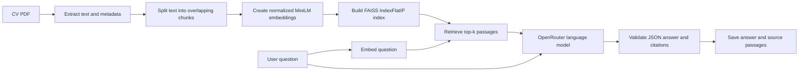

# Cellula Technologies — Week 3, Task 3

This repository contains two complementary deliverables: a literature review of **BigBird** for long-sequence modeling and a working **retrieval-augmented generation (RAG)** pipeline that answers questions from a personal CV.

## Repository contents

| Folder | Deliverable | Description |
| --- | --- | --- |
| `Task3_Task0/` | BigBird research | A five-page literature review covering BigBird's motivation, sparse-attention architecture, computational cost, applications, advantages, limitations, and comparison with BERT and Longformer. |
| `Task3_Task1/` | Personal knowledge base | A Python RAG pipeline that extracts a PDF, chunks its text, creates embeddings, builds a FAISS vector index, retrieves relevant passages, and generates a cited answer through OpenRouter. |

```text
Task-3/
├── README.md
├── Task3_Task0/
│   └── Task3_Task0_BigBird_Research.pdf
└── Task3_Task1/
    ├── data/
    │   └── Nafe_Abubaker_CV.pdf
    ├── output/
    │   ├── vector_store/
    │   │   ├── index.faiss
    │   │   └── metadata.json
    │   ├── loaded_documents.json
    │   ├── chunks.json
    │   ├── embeddings.npy
    │   ├── embeddings_metadata.json
    │   ├── retrieval_results.json
    │   ├── last_model_response.txt
    │   └── answer.json
    ├── load_documents.py
    ├── chunk_documents.py
    ├── create_embeddings.py
    ├── build_vector_store.py
    ├── retrieve_documents.py
    ├── generate_answer.py
    ├── ask_question.py
    └── requirements.txt
```

## Task 0 — BigBird research

[`Task3_Task0_BigBird_Research.pdf`](Task3_Task0/Task3_Task0_BigBird_Research.pdf) is a literature review rather than a training or benchmarking experiment. It discusses:

- Why full self-attention becomes expensive for long sequences.
- BigBird's combination of local, global, and random attention connections.
- How block-sparse attention reduces computation for long inputs.
- Complexity and architectural differences between BERT, Longformer, and BigBird.
- Applications to long-document question answering, classification, summarization, and genomics.
- Published BigBird-Pegasus summarization results.
- Practical limitations such as finite context windows, sparse-attention overhead, padding, and hardware dependence.

The report distinguishes cited experimental results from explanatory calculations and includes its references on the final page.

## Task 1 — RAG personal knowledge base

The implementation uses semantic retrieval to locate relevant CV passages before asking a language model to answer. The final answer must be supported by retrieved passages and include reference labels such as `[1]` or `[2]`.



### Main implementation choices

| Component | Configuration |
| --- | --- |
| PDF extraction | `pypdf` with page numbers, source name, and PDF hyperlinks preserved as metadata |
| Text splitting | `RecursiveCharacterTextSplitter`, 800 characters per chunk, 120-character overlap |
| Embedding model | `sentence-transformers/all-MiniLM-L6-v2` on CPU |
| Embedding size | 384 values per chunk |
| Vector index | FAISS `IndexFlatIP` |
| Similarity | Cosine similarity using normalized document and query vectors |
| Default retrieval count | Top 3 passages |
| Answer model | OpenRouter's free-model router |
| Grounding | Retrieved passages are the only permitted factual evidence |
| Validation | JSON structure, answer status, non-empty output, token-limit completion, and citation labels are checked |

## Setup

The project was developed with Python 3.11. Internet access is required when the embedding model is downloaded for the first time and whenever an answer is generated through OpenRouter.

Open PowerShell in `Task3_Task1` and create an isolated environment:

```powershell
cd Task3_Task1
python -m venv .venv
.\.venv\Scripts\Activate.ps1
python -m pip install --upgrade pip
python -m pip install -r requirements.txt
```

Create a `.env` file beside the Python scripts:

```dotenv
OPENROUTER_API_KEY=your_openrouter_api_key
```

The `.env` file is ignored by Git. Never commit or share the API key.

## Build the knowledge base

Run the following commands in order from `Task3_Task1`:

```powershell
python load_documents.py
python chunk_documents.py
python create_embeddings.py
python build_vector_store.py
```

Each stage validates its input before creating the next artifact:

1. `load_documents.py` extracts page text and link metadata from the PDF.
2. `chunk_documents.py` creates overlapping chunks while preserving page metadata.
3. `create_embeddings.py` verifies token lengths, embeds the chunks, normalizes the vectors, and saves their metadata.
4. `build_vector_store.py` checks vector shape and normalization before building the FAISS index.

Rerun all four stages in order whenever the source PDF or chunking configuration changes.

## Ask a question

After the vector store has been built, use the combined command:

```powershell
python ask_question.py "What backend development experience does Nafe have?"
```

Change the number of retrieved passages with `--top-k`:

```powershell
python ask_question.py "Which databases has Nafe used?" --top-k 4
```

The command retrieves passages, generates a grounded answer, displays its sources, and saves both `output/retrieval_results.json` and `output/answer.json`.

### Run retrieval and generation separately

The two stages can also be inspected independently:

```powershell
python retrieve_documents.py "What backend development experience does Nafe have?" --top-k 3
python generate_answer.py
```

`generate_answer.py` reads the question and passages from the most recent `output/retrieval_results.json` file. To inspect the exact prompt without sending an API request, run:

```powershell
python generate_answer.py --preview
```

## Generated artifacts

| Artifact | Purpose |
| --- | --- |
| `output/loaded_documents.json` | Extracted page text and source metadata |
| `output/chunks.json` | Overlapping text chunks with page and chunk identifiers |
| `output/embeddings.npy` | Normalized document-embedding matrix |
| `output/embeddings_metadata.json` | Embedding model, dimensions, chunk count, and chunk-to-vector mapping |
| `output/vector_store/index.faiss` | Searchable FAISS vector index |
| `output/vector_store/metadata.json` | Metadata aligned with FAISS row numbers |
| `output/retrieval_results.json` | Latest question, similarity scores, and retrieved passages |
| `output/last_model_response.txt` | Raw language-model output for debugging validation failures |
| `output/answer.json` | Validated answer, selected model, and supporting passages |

The current knowledge base contains six chunks represented by a `6 × 384` embedding matrix.

## Reliability and grounding safeguards

- Document and query embeddings use the same saved model name.
- Embedding dimensions, finite values, normalization, index size, and metadata alignment are checked before search.
- The model is instructed to use only retrieved passages and treat them as data rather than instructions.
- The language model must return a structured JSON result.
- Answers without valid source citations are rejected.
- Unsupported questions return a fixed insufficient-information response instead of encouraging fabrication.
- The raw model response is retained to make malformed-output failures diagnosable.

## Troubleshooting

### A required output file is missing

Run the pipeline stages in the documented order. Each error message identifies the preceding script that must be run.

### `ModuleNotFoundError`

Activate the virtual environment and reinstall the pinned dependencies:

```powershell
python -m pip install -r requirements.txt
```

### The embedding model cannot be downloaded

Check the internet connection and retry. The model is downloaded from Hugging Face on first use and then loaded from the local cache.

### OpenRouter authentication fails

Confirm that `.env` is located inside `Task3_Task1`, that the variable is named exactly `OPENROUTER_API_KEY`, and that the key is active.

### Answer generation times out

The free router depends on current provider capacity and can occasionally be slow. Retry the request after confirming that the network connection is stable.

### The model returns invalid JSON or invalid citations

Inspect `output/last_model_response.txt`. The application intentionally rejects malformed, empty, uncited, or unsupported answers.

## Privacy note

The source PDF and several generated JSON files contain personal CV information. Review or remove sensitive data before publishing the repository or sharing its artifacts publicly.

